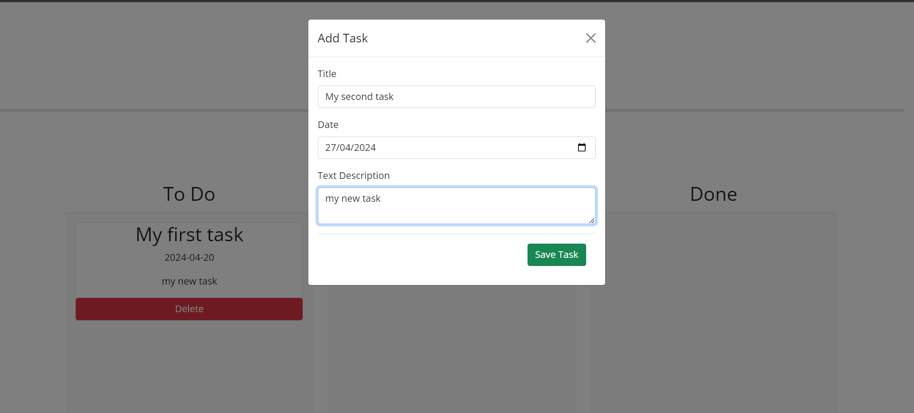

# Draggable-Form

A webside to recolect and show tasks that the user has.

## Table of Contents

- [Introduction](#introduction)
- [Features](#features)
- [Installation](#installation)
- [Usage](#usage)
- [Preview](#preview)
- [Contributing](#contributing)

## Introduction

The website will assist the user in saving and displaying tasks that are yet to be done or have already been completed. Additionally, it aids in organizing these tasks by allowing them to be moved between columns once they are completed or in the process of being completed. This functionality enables users to easily distinguish between tasks that are pending and those that have been accomplished.

## Features 

-Get the title, date and text-content of your task.
-Display of the strings provided before.
-Intereactive website that shows the tasks to do.
-Interactive interfaz to move the tasks in diferents positions depending of the user priority.
-Interactive botton to delete the task once is done or is not any more necesary to do.

## Instalation

``bash
git clone git@github.com:ANDRESGOM77/Draggable-Form.git
git pull

## Usage

To utilize the Draggable-Form, users will need to click on the "Add Task" button to begin. Once clicked, they can fill in the respective contents for the website to create the task card. After the card is created, it can be moved depending on whether the task is in progress or completed.

## preview

The following image demonstrates the web application's appearance and functionality:

  

## Contributing

If you would like to contribute to the development of the My-New-Blog, please follow these guidelines:

-Fork the repository.
-Create a new branch for your feature or bug fix.
-Make your changes and commit them with descriptive messages.
-Push your changes to your fork.
-Submit a pull request to the main repository.